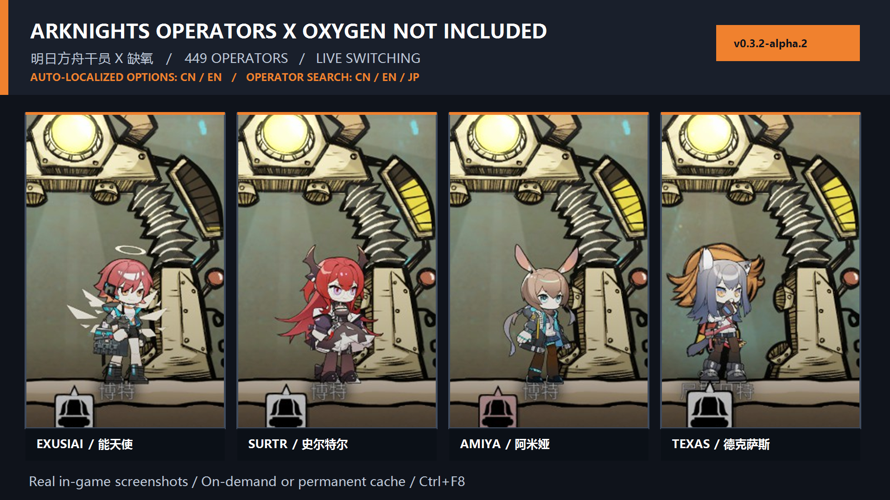

<div align="center">

# arknights-oni

**Bring Arknights operators into Oxygen Not Included.**

Operators are available today. Voice, base furniture, enemies, and visual effects are on the roadmap. Arknights is the first reference implementation for a future reusable ONI content framework.

[English](./README.md) · [简体中文](./README.zh-CN.md) · [Steam Workshop](https://steamcommunity.com/sharedfiles/filedetails/?id=3765340857) · [Usage: EN / 中文 / 日本語](./docs/usage_multilingual.md) · [Roadmap](#current-progress--roadmap) · [Installation](#installation)

[](https://github.com/nya-a-cat/arknights-oni/releases/tag/v0.3.2-alpha.2)


[](https://github.com/nya-a-cat/arknights-oni)

</div>



> [!IMPORTANT]
> Version `0.3.2-alpha.2` currently implements the **Arknights Operators** module. It replaces duplicant visuals with selectable operator Spine models and maps movement, work, rest, sleep, stress, and death states to matching animations.
>
> Each duplicant can keep its own operator, skin, and model. A global default remains available for new duplicants and for duplicants without an individual override.
>
> This is an Alpha release. Several game-integration scenarios remain under validation.
>
> Steam Workshop title: **Arknights Operators / 明日方舟干员 [Alpha]**. In-game Mods menu title: **Arknights Operators（明日方舟干员）**.

The current release has been smoke-tested in a four-duplicant isolated save on Oxygen Not Included build 740622. Texas, Amiya, Kal'tsit, and Exusiai were assigned to four different duplicants, saved, and restored after a full save reload.

## What makes it special?

- Search a catalog of 449 operators by Chinese, English, or Japanese name, PRTS redirect alias, or `char_id` inside the game.
- Use automatically selected Chinese or English option labels; operator display names prefer Chinese, Japanese, or English according to the current game language and available PRTS metadata.
- Select an operator, skin, and model through linked controls.
- Select a duplicant and press `Ctrl+F8` to assign its operator, skin, and model live; use `Ctrl+Shift+F8` for global defaults.
- Render Spine 3.8 Region/Mesh attachments, clipping, multiple atlas pages, and common blend modes directly in C#.
- Map ONI movement, work, rest, sleep, stress, and death states to available operator animations.
- Automatically use base models for daily/sleep states and front combat models for digging, combat, stun, and death.
- Select a duplicant and press `Ctrl+F9` to open its action wheel for manual animation performances; the center button restores automatic mapping.
- Choose between a bounded 512 MiB on-demand LRU cache and permanent retention of downloaded resources.
- Merge concurrent requests for the same resource while allowing each duplicant to cancel its own wait independently.
- Verify downloads with HTTPS source restrictions, temporary files, a SHA-256 index, and a 64 MiB per-file limit.
- Recover all 449 catalog operators through a versioned manifest and per-operator GitHub Release packages when PRTS metadata or asset delivery fails.
- Fall back through the original duplicant visual, an optional bundled Spine asset, and the legacy frame path when an appearance cannot be loaded.

## Installation

### Prerequisites

- Oxygen Not Included for Windows installed through Steam.
- WSL with Mono `mcs` available.

The repository does not install a compiler, browser, or large dependency automatically.

### Build and install

```bash
cd arknights_oni_mod_work/ArknightsOperatorsMod
./build.sh
./install_local.sh
```

The default local Mod directory is:

```text
C:\Users\<you>\Documents\Klei\OxygenNotIncluded\mods\Local\ArknightsOperatorsMod
```

Set `ONI_GAME_ROOT` to override the game directory or `ONI_LOCAL_MOD_DIR` to override the installation target.

Earlier local prototypes used the `AmiyaDuplicantMod` directory. The default installer migrates that local directory plus its configuration/cache when the new target does not exist. The hidden legacy `staticID` remains as a compatibility key so existing saves continue to recognize the renamed Mod.

> [!TIP]
> Start the game through Steam, enable **Arknights Operators（明日方舟干员）** in the Mods menu, and restart when prompted. Launching the game executable directly can trigger Klei's Mod Safe Mode in some Steam environments.

The Git source repository does not contain Arknights artwork, Spine skeletons, atlases, or copied PRTS web bundles. PRTS remains the primary on-demand source. If its metadata contract or file delivery fails, the Mod loads a pinned fallback manifest and the selected operator's package from the project's GitHub Release. The full 449-operator snapshot is generated on GitHub Actions, so contributors do not need to download it locally.

The existing 64 MiB limit applies to an individual Spine source file as a download safety check. Release packages are fetched only for the selected operator and have a separate 512 MiB technical safety ceiling. The 100 MB preference used during local development is a disk-space preference: the cloud builder reports larger packages and continues.

## Resource strategies

| Mode | Behaviour | Best for |
| --- | --- | --- |
| On-demand cache (recommended) | Fetch only the selected appearance. When the cache exceeds 512 MiB, evict the least recently used files that are not referenced. | Keeping disk usage bounded |
| Keep downloaded resources | Fetch only the selected appearance and retain successfully cached files without capacity eviction. | Reusing visited appearances offline |

Neither mode pre-downloads the full operator catalog.

Fallback packages follow the same retention choice. On-demand mode may evict an unused operator package under the 512 MiB LRU budget; permanent mode keeps successfully downloaded packages.

See the [GitHub Release fallback design](./docs/github_release_asset_fallback.md) for the manifest contract, cloud build flow, trust boundary, and publication checklist.

## Current progress & Roadmap

### Operators

- [x] Searchable 449-operator catalog with Chinese, English, Japanese, redirect-alias, and `char_id` lookup
- [x] Linked operator, skin, and model selection
- [x] Live switching from Options and `Ctrl+F8`
- [x] Runtime animation mapping and ground alignment
- [x] Semantic build/battle animation profiles and a per-duplicant `Ctrl+F9` action wheel
- [x] Per-duplicant operator, skin, and model settings with save persistence
- [ ] Operator-specific collision profiles for visual size differences, with validation for pathfinding, ladders, beds, selection bounds, and save compatibility
- [ ] Per-duplicant voice settings
- [ ] Operator voice with language selection, preview, cooldown, and priority
- [ ] Appearance preview, favourites, presets, and Printing Pod assignment pools

### Arknights content

- [ ] Base furniture, room themes, and animated decorations
- [ ] Enemy and creature appearance packages
- [ ] Assignable enemy and boss skins for duplicants, including examples such as The Demon King Amiya and Patriot
- [ ] Skill, combat, work, and environmental effects
- [ ] Typed content packages: `operator`, `voice`, `furniture`, `enemy`, and `effect`

### Platform quality

- [x] Automatic Chinese/English localization for the operator options interface
- [x] Chinese/English/Japanese operator-name search from PRTS encyclopedia metadata
- [x] Versioned all-operator fallback manifest, verified Release-package loader, and sharded GitHub Actions builder
- [ ] Generate, inspect, and publish the initial 449-operator `assets-v1.0.0` snapshot
- [ ] Move remaining runtime errors and diagnostics into ONI `STRINGS` resources and add more interface locales
- [ ] Cache manager, download status, and diagnostics export
- [ ] Versioned configuration migration and catalog updates
- [ ] Compatibility controls for other appearance Mods

### Long-term framework direction

- [ ] Re-evaluate `arknights-oni` as a reusable ONI content framework after the Arknights content pipeline matures
- [ ] Extract stable content lifecycle, cache, selection, event mapping, and package contracts into a reusable core
- [ ] Keep Arknights as the first reference content pack and compatibility suite
- [ ] Evaluate content packs inspired by other games, with **BanG Dream!** as an example candidate

See the [complete code review and roadmap](./docs/code_review_and_roadmap_20260715.md) for priorities, acceptance criteria, performance limits, and resource boundaries.

## Development

```bash
cd arknights_oni_mod_work/ArknightsOperatorsMod
./build.sh
./tests/run_operator_animation_mapper_tests.sh
./tests/run_operator_appearance_catalog_tests.sh
./tests/run_mod_localization_tests.sh
./tests/run_resource_index_tests.sh
python3 ./tests/test_fallback_release_builder.py
./tests/run_operator_fallback_tests.sh
./tests/run_operator_asset_resolver_integration.sh
```

The final integration test downloads a real, small PRTS fixture. The fallback test uses an in-memory Release package and simulated primary-source failure. The remaining tests use only local code and fixtures.

## Repository layout

- `arknights_oni_mod_work/ArknightsOperatorsMod/src`: Mod entry points, settings, cache, resource resolution, rendering, and animation mapping.
- `arknights_oni_mod_work/ArknightsOperatorsMod/tests`: Logic tests and the real small-resource integration test.
- `arknights_oni_mod_work/ArknightsOperatorsMod/lib`: PLib plus the pinned Spine C# runtime sources and provenance notes.
- `docs`: PRTS asset research, architecture and acceptance notes, and the detailed roadmap.

## Project boundaries & third-party components

This is a non-commercial fan project with no affiliation with or endorsement by Klei, Hypergryph, or PRTS Wiki. Game and character rights belong to their respective owners. The public Git repository contains original Mod source code, tests, development notes, lightweight catalog metadata, separately licensed third-party code, and a promotional montage made from real gameplay screenshots. Runtime artwork and animation assets are retrieved by the user on demand from PRTS or, after a primary-source failure, from a versioned project Release snapshot.

No additional open-source license is currently granted for the original code. PLib, the Spine runtime, and catalog metadata remain subject to their respective licenses and source notices. See [THIRD_PARTY_NOTICES.md](./THIRD_PARTY_NOTICES.md) and [DATA_NOTICE.md](./DATA_NOTICE.md).
