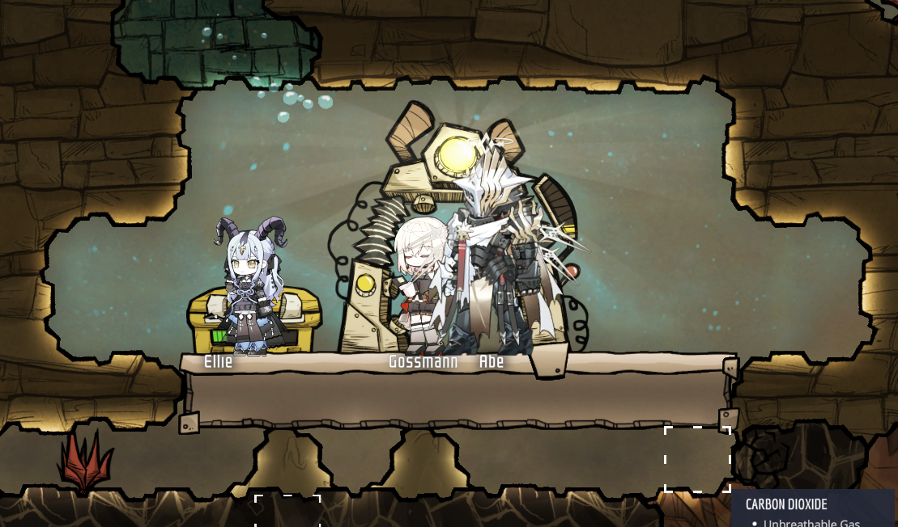

<div align="center">

# arknights-oni

**把明日方舟干员带进《缺氧》。**

当前版本已经支持干员外观，后续计划加入语音、基建家具、敌人和特效。明日方舟会作为未来通用 ONI 内容框架的第一套参考实现。

[English](./README.md) · [简体中文](./README.zh-CN.md) · [Steam 创意工坊](https://steamcommunity.com/sharedfiles/filedetails/?id=3765340857) · [使用说明：中文 / English / 日本語](./docs/usage_multilingual.md) · [路线图](#当前进度与-roadmap) · [安装](#安装)

[](https://github.com/nya-a-cat/arknights-oni/releases/tag/v0.3.3)


[](https://github.com/nya-a-cat/arknights-oni)

</div>


> [!IMPORTANT]
> 当前 Stable 版本为 `0.3.3`，实现 **Arknights Operators（明日方舟干员）** 的本轮正式更新。
>
> 每个复制人都可以保存自己的干员、皮肤和模型；全局默认继续用于新复制人，以及没有单独覆盖的复制人。
>
> 当前仍属于早期公开版本。兼容问题可以通过 GitHub Issues 或 QQ 群 `785437890` 反馈。
>
> Steam 创意工坊标题为 **Arknights Operators / 明日方舟干员 [0.3.3]**；游戏内“模组”菜单显示为 **Arknights Operators（明日方舟干员）**。

现有四复制人实机记录使用 ONI build 740622 和 `0.3.2-alpha.1` 候选包。德克萨斯、阿米娅、凯尔希和能天使分别分配给四个复制人，保存并完整重载存档后仍保持各自选择。

## 0.3.3 更新内容



版本 `0.3.3` 包含：

- 每页 20 张卡片的 96px 干员图库，只加载当前页头像，失败可以重试，离线时显示名称占位卡。
- 场景内皮肤/模型预览，以及关闭选择面板和保存重载后仍能保持的“应用到此复制人”。
- 默认 `125%` 的视觉大小，以及按 `char_id + 皮肤 + 模型` 保存的 `75–200%` 独立倍率。
- 用户可填写 `128–2000 MiB` 的按需缓存容量，默认 `512 MiB`，并保留永久保存已下载资源的模式。
- 移动兼容过滤。轻量源目录仍记录 449 个干员；选择界面显示 420 个具备基建移动模型的干员，并隐藏缺少基建走路模型的 30 个皮肤，因此 29 个纯战斗角色不能再被新选择。

上方图片是最终开发测试中的未经修改实机截图。

## 项目特色

- 在游戏内按中文名、英文名、日文名、PRTS 重定向别名或 `char_id` 搜索 449 个干员的元数据；选择界面显示其中 420 个具备移动模型的干员。
- 设置界面自动选择中文或英文，干员显示名会结合当前游戏语言和 PRTS 已提供的中文、日文、英文元数据。
- 联动选择干员、具备移动模型的皮肤和模型。
- 以每页 20 张卡片浏览 96px PRTS 干员头像；右侧放大当前头像，离线或缺图时显示名称占位卡。
- 选中复制人后按 `Ctrl+F8` 单独设置干员、皮肤和模型；按 `Ctrl+Shift+F8` 打开轻量的全局资源、模型切换和大小设置。
- 使用 C# 实时渲染 Spine 3.8 Region/Mesh、clipping、多 atlas page 和常用 blend mode。
- 将 ONI 的移动、工作、休息、睡眠、压力和死亡状态映射到可用的干员动画。
- 日常与睡眠状态自动使用基建模型，挖矿、战斗、眩晕和死亡自动使用正面战斗模型。
- 选中复制人后按 `Ctrl+F9` 打开该复制人的动作转盘，手动表演动画；点击中心按钮恢复自动映射。
- 提供可填写 `128–2000 MiB`、默认 `512 MiB` 的按需 LRU 缓存，以及永久保留已下载资源策略。
- 默认把干员视觉大小设为 `125%`，可在 `75%–200%` 范围调整；修改后会直接更新已加载外观，不会重新下载资源。
- 合并相同资源的并发请求，同时允许每个复制人独立取消自己的等待。
- 使用 HTTPS 来源限制、临时文件、SHA-256 索引校验和 64 MiB 单文件上限保护下载过程。
- 已准备带校验的加载器和云端生成器，用于版本化的 449 干员 GitHub Release 备用快照；首个 `assets-v1.0.0` 快照仍未发布。
- 外观加载失败时依次回退到原始复制人外观、可选内置 Spine 资源和旧帧路径。

## 安装

### 前提

- 通过 Steam 安装的 Windows 版《缺氧》。
- WSL 中可运行 Mono `mcs`。

仓库不会自动安装编译器、浏览器或大型依赖。

### 构建并安装

下面的命令构建并安装现有本地兼容路径使用的 Stable 身份：

```bash
cd arknights_oni_mod_work/ArknightsOperatorsMod
./build.sh
./install_local.sh
```

默认本地 Mod 目录：

```text
C:\Users\<你的用户名>\Documents\Klei\OxygenNotIncluded\mods\Local\ArknightsOperatorsMod
```

使用 `ONI_GAME_ROOT` 指定游戏目录，使用 `ONI_LOCAL_MOD_DIR` 指定安装目标。

早期本地原型使用 `AmiyaDuplicantMod` 目录。默认安装脚本会在新目标尚未存在时迁移旧本地目录及其配置/缓存。隐藏的旧 `staticID` 继续作为兼容键，使现有存档能够识别改名后的 Mod。

> [!TIP]
> 从 Steam 启动游戏，在“模组”中启用 **Arknights Operators（明日方舟干员）**，并按提示重启。部分 Steam 环境中直接启动游戏 EXE 会触发 Klei 的 Mod Safe Mode。

Git 源码仓库不包含明日方舟图片、Spine 骨骼、atlas 或复制的 PRTS 网页构建产物。PRTS 仍是当前按需来源。备用加载器和 GitHub Actions 生成器已经为固定清单及当前选择干员的资源包准备好，首个 `assets-v1.0.0` 快照仍未发布。快照完成审查并发布后，贡献者可以在云端生成，无需在本机下载全部 449 干员资产。

现有 64 MiB 限制只用于单个 Spine 源文件的下载安全检查。备用快照发布后，Release 干员包只会在选中该干员且主来源失败时获取，并继续使用独立的 512 MiB 异常响应技术上限。开发时提到的 100 MB 是本机磁盘空间偏好；云端生成器只报告超过该体积的包并继续处理。

## 资源策略

版本 `0.3.3` 提供 `128–2000 MiB` 的整数按需缓存容量设置，默认值为 `512 MiB`。

| 模式 | 行为 | 适用场景 |
| --- | --- | --- |
| 按需缓存（推荐） | 只获取当前选择的外观；容量可填写 `128–2000 MiB` 的整数，默认 `512 MiB`；设置页显示当前占用和目标容量，并清理最久未使用且未处于使用、下载或租约保护状态的资源 | 控制磁盘占用 |
| 永久保留已下载资源 | 只获取当前选择的外观；成功缓存后不执行容量清理；容量输入框禁用并保留原值，切回按需模式时继续使用 | 希望已访问外观长期离线可用 |

两种模式都不会预下载完整干员目录。

备用快照发布后，干员包沿用同一保留策略：按需模式会在用户选择的 LRU 预算内清理未使用的包，永久模式会保留成功下载的包。用户可调缓存预算不会改变 `64 MiB` 单个源文件限制和 `512 MiB` 备用包安全上限。

清单合同、云端生成流程、信任边界和发布检查清单见 [GitHub Release 备用资源设计](./docs/github_release_asset_fallback.md)。

## 当前进度与 Roadmap

### 干员

- [x] 支持中文、英文、日文、重定向别名和 `char_id` 的 449 干员目录
- [x] 干员、皮肤和模型联动选择
- [x] 移动兼容过滤：选择界面保留 420 个干员，隐藏 29 个纯战斗角色和 30 个缺少基建走路模型的皮肤
- [x] 96px 干员头像分页图库、仅当前页加载、名称占位卡，以及场景内 Spine 皮肤/模型预览（代码完成，等待实机验证）
- [x] 通过 `Ctrl+F8` 实时切换单个复制人，并在 Mod Options 中提供轻量的全局运行与资源设置
- [x] 运行时动画映射与地面对齐
- [x] 基建/战斗语义动画档案，以及逐复制人的 `Ctrl+F9` 动作转盘
- [x] 每个复制人独立设置干员、皮肤和模型，并随存档持久化
- [ ] 干员专属碰撞体配置，适配视觉尺寸差异，并验证寻路、梯子、床铺、选择范围和存档兼容性
- [ ] 每个复制人独立设置语音
- [ ] 干员语音、语种选择、试听、冷却和优先级
- [ ] 收藏、预设和打印舱分配池

### 明日方舟内容

- [ ] 基建家具、房间主题和可动装饰
- [ ] 敌人及生物外观内容包
- [ ] 允许复制人选择敌人和首领外观皮肤，例如魔王阿米娅、爱国者；第一阶段只替换视觉外观
- [ ] 技能、战斗、工作和环境特效
- [ ] `operator`、`voice`、`furniture`、`enemy`、`effect` 类型化内容包

### 基础质量

- [x] 干员设置界面自动使用中文或英文
- [x] 基于 PRTS 百科元数据的中文、英文、日文干员名搜索
- [x] 全干员版本化备用清单、带校验的 Release 包加载器和 GitHub Actions 分片生成器
- [ ] 将内容获取演进为“`本地缓存 → 固定 GitHub Release → 有界 PRTS 回退`”，manifest 固定 Release tag、字节长度和 SHA-256
- [ ] 由低并发 GitHub Actions 生成版本化逐干员包；禁止全目录预取，执行重试退避与限流，并把 GitHub Release 备用中转/快照逐步覆盖到 Spine、头像、语音、家具、敌人和特效
- [x] 可设置 `128–2000 MiB` 的缓存，默认 `512 MiB`，支持立即 LRU 维护并保护正在使用的资源
- [ ] 生成、检查并发布首个 449 干员 `assets-v1.0.0` 快照
- [ ] 把其余运行时错误与诊断迁移到 ONI `STRINGS`，并增加更多界面语种
- [ ] 缓存管理器、下载状态和诊断导出
- [ ] 版本化配置迁移与目录更新
- [ ] 与其他外观 Mod 的兼容控制

### 长期框架方向

- [ ] 明日方舟内容管线成熟后，将 `arknights-oni` 作为通用 ONI 内容框架进行一次正式重估
- [ ] 把稳定的内容生命周期、缓存、选择、事件映射和内容包合同抽取为可复用核心
- [ ] 保留明日方舟作为第一套参考内容包和兼容性测试集
- [ ] 评估其他游戏的内容包，**BanG Dream!** 作为示例候选方向之一

详细优先级、验收标准、性能限制和资源使用边界见[完整代码审查与路线图](./docs/code_review_and_roadmap_20260715.md)。

## 开发

当前 Stable 版本为 `0.3.3`。`main` 保存实机验证通过的稳定代码，`develop` 承载日常集成，高风险改动使用隔离的 `feature/*`。Nightly 与 RC 使用独立 Testing 身份，现有 Steam 创意工坊条目只接收 Stable 包。详见[分支与发布通道](./docs/release_channels.md)。

在仓库根目录使用以下命令分别打包各身份：

```powershell
powershell -ExecutionPolicy Bypass -File .\tools\build_mod_release.ps1 -Channel Stable -Version v0.3.3
powershell -ExecutionPolicy Bypass -File .\tools\build_mod_release.ps1 -Channel Dev -Nightly
powershell -ExecutionPolicy Bypass -File .\tools\build_mod_release.ps1 -Channel RC -Version v0.3.3-rc.1
powershell -ExecutionPolicy Bypass -File .\tools\install_testing_mod.ps1 -PackagePath <testing-zip>
```

第一条生成 Stable 身份；Dev 和 RC 生成隔离的 Testing 身份；最后一条只安装 Testing 包。

各通道 DLL 已经生成后，运行本地完整产物探针：

```powershell
powershell -ExecutionPolicy Bypass -File .\tools\test_packaging_artifacts.ps1
```

该探针检查三种包身份、ZIP/sidecar 哈希、Testing 隔离安装和 Nightly 保留策略。它只使用仓库 `.cache` 下的临时根目录，不会触碰真实游戏或 Local Mods 目录。

```bash
cd arknights_oni_mod_work/ArknightsOperatorsMod
./build.sh
./tests/run_operator_animation_mapper_tests.sh
./tests/run_operator_appearance_catalog_tests.sh
python3 ./tests/test_operator_catalog_thumbnails.py
./tests/run_operator_thumbnail_loader_tests.sh
./tests/run_mod_localization_tests.sh
./tests/run_resource_index_tests.sh
python3 ./tests/test_fallback_release_builder.py
./tests/run_operator_fallback_tests.sh
./tests/run_operator_asset_resolver_integration.sh
```

最后一项集成测试会下载 PRTS 的真实小型 fixture；备用源测试使用内存中的 Release 包并模拟主来源失败；其余测试只使用本地代码和 fixture。

## 仓库结构

- `arknights_oni_mod_work/ArknightsOperatorsMod/src`：Mod 入口、设置、缓存、资源解析、渲染和动画映射。
- `arknights_oni_mod_work/ArknightsOperatorsMod/tests`：逻辑测试和真实小资源集成测试。
- `arknights_oni_mod_work/ArknightsOperatorsMod/lib`：PLib、固定版本 Spine C# runtime 源码及来源说明。
- `docs`：PRTS 资产研究、架构验收记录和详细路线图。

## 项目边界与第三方组件

这是一个非商业同人项目，与 Klei、鹰角网络及 PRTS Wiki 没有隶属或背书关系。游戏及角色相关权利归各自权利人所有。公开 Git 仓库包含原创 Mod 源码、测试、开发文档、轻量目录元数据、单独许可的第三方代码，以及由真实游戏截图排版而成的宣传图。运行时美术和动画资源当前由用户按需从 PRTS 获取；首个版本化资产快照完成审查和发布后，已准备的 Release 备用路径才会可用。

原创代码当前没有授予额外的开源许可证。PLib、Spine runtime 和目录元数据分别适用各自的许可与来源说明，详见 [THIRD_PARTY_NOTICES.md](./THIRD_PARTY_NOTICES.md) 和 [DATA_NOTICE.md](./DATA_NOTICE.md)。
