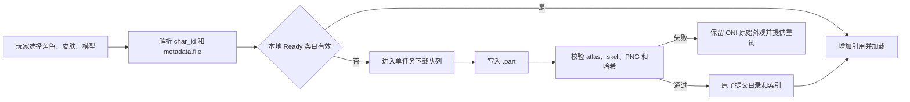

# 第一阶段架构与验收规范

文档日期：2026-07-15

状态：**实施合同。** 本文定义第一阶段应交付的行为和验证证据。文中标为“计划”或“待验证”的条目不能作为完成证明。

相关资料：

- [PRTS 游戏资产与 ONI Mod 架构审计](./prts_asset_audit.md)
- 当前 Mod 根目录：`arknights_oni_mod_work/ArknightsOperatorsMod`

## 1. 第一阶段成功标准

第一阶段完成需要同时满足以下条件：

1. C# Mod 能针对当前 ONI 引用完成编译，产物和清单结构可被当前 Mod 加载器识别。
2. 游戏内 `Mods -> Options` 出现资源保存策略选项，配置跨游戏启动持久化。
3. “按需缓存”和“永久保留已下载资源”按本文语义工作，切换、离线、更新和清理行为可重复验证。
4. 玩家只会触发当前选择角色、皮肤和模型所需资源的下载。第一阶段不启动 449 个角色的全量下载。
5. 下载中断不会产生可加载的半成品；有效缓存可以在离线状态继续使用。
6. 动画解析和映射是确定性的，缺少目标动画时有稳定降级结果。
7. 本地验证网页可以加载代表性 PRTS Spine 资产、模拟 ONI 动作类别并展示映射结果。
8. Playwright 覆盖代表性动画和 Spine 工程特征，保存机器可读结果；需要人工复核时再保存截图。
9. 阿米娅普通模型、clipping 样本、path 样本、双页/双色复杂样本均有明确验证结果。
10. 游戏运行时异常时保留 ONI 原始复制人外观，加载和模拟线程不因网络请求被阻塞。

当前证据状态：**可玩主路径已通过游戏内验收，第一阶段的长期缓存与压力项仍待补测。** 已通过零警告 DLL 编译、42 项动画映射断言、21 项外观目录断言、10 项语言断言、8 项缓存索引断言、四路冷缓存与调用者独立取消解析、同长度缓存损坏恢复和 Playwright 17/17；ONI 模组页 Options、中英日名称与重定向别名搜索、皮肤/模型联动、逐复制人 `Ctrl+F8` 选择、脚底对齐、移动/爬梯与配置持久化均有画面和 `Player.log` 证据。自动基建/战斗模型切换与 `Ctrl+F9` 转盘已完成构建、安装和实机动作验收。离线首次失败、永久策略、20 个复制人压力和引用释放仍保持待验证。旧版 130 个大图 sheet 只保留为原型历史。

## 2. 范围

### 2.1 第一阶段包含

- 全局资源保存策略设置。
- 全局干员、皮肤和模型选择，以及存档内实时切换入口。
- 当前选择资源的目录解析、下载、校验、落盘和索引。
- 当前选择的原始 Spine 资源统一缓存记录，以及复杂模型的网页分类证据。
- 离线复用、资源版本迁移和失败回退。
- PRTS 动画列表驱动的 ONI 动作映射。
- 本地网页验证器和 Playwright 自动化。
- 本地自用安装与验证文档。

### 2.2 第一阶段边界

- 全量角色库预下载不进入第一阶段。
- Unity Editor 和 Unity 自制 AssetBundle 不进入第一阶段依赖。
- GitHub prerelease 与 Steam Workshop Alpha 使用不含游戏美术、Spine、atlas 和网页 bundle 的最小发布包；运行时资源继续按用户当前选择逐项获取。
- 每个 PRTS 资产的逐帧人工视觉认证属于后续扩展；第一阶段覆盖代表性工程特征。
- 旧资源历史版本不会长期归档。永久策略保存当前有效版本。
- 非黑双色模型的 Chrome 按需烘焙接回游戏属于后续复杂视觉增强；第一阶段保留实时 mesh 与原始外观失败回退。

### 2.3 下载体积、来源与本机开发偏好

100 MB 是当前开发机的磁盘空间偏好，用于避免本地误下大包。Mod 格式、GitHub Actions 和玩家客户端可处理更大的对象，并分别执行运行时安全检查。开始获取前完成以下只读检查：

1. 记录官方来源页面或官方仓库。
2. 读取并记录 license；license 缺失或含义不清时停止获取。
3. 通过 `Content-Length`、包管理器元数据或官方发布清单确认单文件大小。
4. 大小未知时先用 HEAD 或元数据检查；服务端不提供长度时，本机任务使用带 100 MB 保护阈值的流式读取。
5. 预计超过 100 MB 时，本机默认不下载并记录原因；可交由 GitHub Actions 构建，玩家也可自行选择获取。云端只报告体积，不因该偏好阻断。

开发依赖与角色资源分别处理：

- 开发依赖包括浏览器、编译器、runtime、测试工具和安装包。第一阶段复用已安装 Windows Chrome，不下载 Playwright Chromium/Chrome，也不安装 Unity Editor。
- 角色资源包括当前选择模型的 `.skel`、`.atlas`、atlas PNG 和按需生成的 sheet。资源按选择下载；本机开发沿用 100 MB 偏好，GitHub Actions 与玩家客户端不继承该偏好。永久模式允许多个已使用资源逐步累计。

所有获取日志至少保存来源、license 判定、声明大小或实收字节数、SHA-256 和结果。

当前 PLib 依赖预检结果：官方 PLib 4.25（U59），MIT License，`PLib.dll` 为 344,576 B。仓库保存 `PLIB-LICENSE.txt`。该依赖远低于本机 100 MB 偏好，Mod 通过现有 ONI/PLib 环境引用，不引入浏览器安装包。

Spine C# runtime 固定到官方提交 `8b4844bd4b193ba9e54487ed397a777993cbad56`。只获取 `spine-csharp/src/**/*.cs` 的 42 个文件，总计 496,886 B，最大单文件 69,423 B；许可证、README 和来源记录随仓库保存。未下载仓库压缩包。

## 3. 用户可见设置

### 3.1 设置项

设置名称：`资源保存策略`、`按需缓存容量（MiB）`

默认值：`按需缓存（推荐）`、`512 MiB`

| UI 选项 | 下载触发 | 自动清理 | 适用场景 |
| --- | --- | --- | --- |
| 按需缓存（推荐） | 玩家选择尚未缓存的角色、皮肤或模型 | 超过用户设置的 `128–2000 MiB` 容量后按最久未使用顺序清理；默认 `512 MiB` | 希望控制磁盘占用 |
| 永久保留已下载资源 | 玩家选择尚未下载的角色、皮肤或模型 | 不自动清理已完成资源；容量输入禁用并保留原值 | 希望选过一次后长期离线使用 |

两种策略均按选择下载。界面说明需要明确“永久保留”不会自动下载完整角色库。

`0.3.3` 的容量输入只接受整数。空值、文本以及小于 `128` 或大于 `2000` 的值阻止保存，并显示 `128–2000 MiB` 范围提示。界面同时显示“当前占用 / 目标容量”。已经发布的 `0.3.2-alpha.2` 仍使用固定 `512 MiB` 预算；本节新增合同属于 `0.3.3` 开发线。

### 3.2 外观选择与存档内入口

PLib Options 已实现四行联动设置：

1. `搜索干员`：接受中文名或稳定 `char_id`；精确唯一匹配时自动选择。
2. `干员`：最多展示 60 个当前搜索结果；重名干员同时显示 `char_id` 供玩家区分。
3. `皮肤`：只枚举当前干员 metadata 中真实存在的皮肤。
4. `模型`：只枚举当前皮肤中真实存在的模型。

下拉数据来自随 Mod 安装的 `operator_appearances_20260604.json`，快照含 449 个干员、954 组皮肤和 2815 个模型，文件 185,311 B。快照只保存名称和层级，不包含 `.skel`、`.atlas` 或纹理。

模组管理页 Options 与存档内 `Ctrl+Shift+F8` 修改全局默认。选中复制人后按 `Ctrl+F8` 打开单独外观选择器；只覆盖该复制人的干员、皮肤和模型，资源策略与自动模型切换继续继承全局设置。单独覆盖通过 ONI 存档序列化保存；“恢复全局默认”会清除覆盖并立即重新加载全局选择。

实时切换采用完整资源替换：旧外观和资源租约会保持到新 atlas、骨骼和材质解析成功；失败时继续显示当前外观。第一次加载失败仍按内置阿米娅 Spine、旧帧和原始复制人顺序回退。

### 3.3 辅助信息和操作

`0.3.3` 设置页合同要求在资源策略和外观选择之外增加容量输入及“当前占用 / 目标容量”。容量输入仅在 `OnDemandCache` 下可编辑；切换到 `Permanent` 后禁用输入，同时保留数值。以下信息和操作仍属于后续设置页增强：

- 可自动清理大小。
- 永久保留大小。
- 当前下载状态或最近一次错误。
- `清理按需缓存` 按钮。
- `删除全部已下载资源` 按钮，执行前二次确认。

删除操作不得删除配置文件、存档中的角色选择或 Mod 安装文件。删除后，正在使用的外观保持到当前资源引用释放；下一次需要该外观时重新下载。

### 3.4 策略切换

| 切换 | 立即行为 | 后续行为 |
| --- | --- | --- |
| 按需缓存 -> 永久保留 | 已有文件和索引不变，容量输入禁用且保留原值，全局策略停止自动清理 | 后续实际下载资源同样免于自动清理 |
| 永久保留 -> 按需缓存 | 已有文件和索引不变；保存后立即按保留的目标容量执行 LRU 维护 | 后续下载和资源释放继续触发容量检查 |
| 按需缓存下调容量 | 保存后立即按新容量执行 LRU 维护 | 受保护资源释放后再次维护，直到达到目标或只剩受保护资源 |
| 任意策略 -> 同一策略 | 不重写资源文件 | 只保存配置时间和必要的 schema 更新 |

以下条目始终受保护：正在下载、正在校验、正在被复制人引用、等待原子替换的当前有效版本。

受保护条目的实际占用可以暂时高于目标容量。设置页必须显示这一状态；任何受保护资源释放后再次安排维护。

## 4. 配置和缓存目录

根目录由 ONI 用户数据目录解析，目标结构为：

```text
Documents/Klei/OxygenNotIncluded/mods/config/ArknightsOperatorsMod/
├─ config.json
├─ cache-index.json
├─ assets/
│  └─ <调用方提供的安全相对路径>/...
└─ tmp/
   └─ <job-id>/*.part
```

目录名使用 `char_id` 和稳定哈希键。皮肤、模型和动画的中文展示名保存在索引中，避免文件系统保留字符、重名和重命名影响缓存身份。

### 4.1 配置合同

计划中的最小配置结构：

```json
{
  "SchemaVersion": 3,
  "DownloadPolicy": "按需缓存（512 MiB）",
  "CacheCapacityMiB": 512,
  "DefaultCharacterId": "char_002_amiya",
  "PreferredSkin": "默认",
  "PreferredModel": "基建",
  "AutomaticModelSwitching": true
}
```

- `DownloadPolicy` 的既有序列化值保留“512 MiB”字样用于旧配置兼容；实际按需目标以 `CacheCapacityMiB` 为准。
- 未找到配置、JSON 损坏或枚举值未知时使用 `OnDemandCache`。默认角色、皮肤和模型分别使用 `char_002_amiya`、“默认”和“基建”。
- 旧配置缺少 `CacheCapacityMiB` 时迁移为 `512`。磁盘配置中的容量小于 `128`、大于 `2000` 或无法解析时恢复为 `512` 并记录警告。
- `AutomaticModelSwitching=true` 时，日常、移动、睡觉和坐下使用基建模型；挖矿、战斗、眩晕和死亡使用正面模型。关闭后固定使用 `PreferredModel`。
- `CacheCapacityMiB` 仅改变 LRU 目标；`PrtsAssetClient` 的 `64 MiB` 单个 Spine 源文件限制与备用 ZIP 的 `512 MiB` 异常响应/压缩炸弹安全上限保持固定。
- 写配置采用临时文件加同目录原子替换。
- 未知字段读取时忽略以保持向前兼容；写回时保存 schema 3 已定义字段。

### 4.2 缓存索引合同

索引至少记录：

```json
{
  "SchemaVersion": 1,
  "Entries": [
    {
      "Key": "prts:352:char_002_amiya:<asset-hash>",
      "RelativePath": "spine/352/char_002_amiya/<asset-key>/skeleton.skel",
      "SourceUrl": "https://torappu.prts.wiki/assets/...",
      "ResourceVersion": "352",
      "Length": 0,
      "Sha256": "<uppercase-hex>",
      "LastAccessUtc": "<ISO-8601>"
    }
  ]
}
```

角色、皮肤、模型、资源类型和版本由稳定 `Key` 与 `RelativePath` 编码。策略是全局配置，索引条目无需保存永久标志。

`Sha256` 用于本地完整性校验。PRTS 当前接口没有在本项目中形成签名验证证据，因此该字段不能证明来源真实性。

### 4.3 状态机

服务生命周期使用以下概念状态。`cache-index.json` 只提交已经完成的 `Ready` 文件，下载和错误状态不写入稳定索引：

- `Missing`：索引或文件不存在。
- `Downloading`：只存在 `tmp/<job-id>/*.part`。
- `Validating`：校验 atlas 引用、文件大小、SHA-256、Spine 版本和非空结构。
- `Ready`：完整目录已原子落盘，索引已提交。
- `Failed`：临时文件已隔离，记录可展示错误。
- `Stale`：发现新版本，旧版本仍可供当前调用回退使用。

进程崩溃后，启动扫描会删除或隔离无活动任务对应的 `.part`。索引中的 `Ready` 条目必须重新检查必需文件存在性；校验失败条目转为 `Failed` 或 `Missing`。

## 5. 资源获取和缓存流程



### 5.1 网络约束

- 同一时间只执行一个不同资产的下载任务；相同资源键和版本的并发请求共享同一个在途任务，避免多个复制人重复下载同一文件。
- 单个资源请求建议超时 120 秒；浏览器烘焙任务可使用 180 秒超时。
- 最多重试 3 次，总计最多 4 次请求，使用 1、2、4 秒指数退避。
- `PrtsAssetClient` 使用 64 MiB 单文件技术安全护栏，同时检查响应 `Content-Length` 和流式实收字节数；该护栏独立于本机 100 MB 磁盘空间偏好。
- HTTP 失败、超时、内容为空和 atlas 引用缺失均视为失败。
- 失败不得覆盖已有 `Ready` 版本。
- 游戏模拟、保存和加载流程不得同步等待网络完成。

### 5.2 atlas 下载

atlas 页数由 `.atlas` 内容枚举。每个页名都必须下载并建立独立纹理记录。当前批量审计发现单页为主，`char_1052_kalts2` 已证明双页必须支持。

### 5.3 自动清理

`OnDemandCache` 的清理触发点：

- Mod 初始化完成后的空闲阶段。
- 新资源提交成功后。
- 按需容量或保存策略发生变化并保存后。
- 受保护资源释放后仍超过目标容量时。
- 设置页执行手动清理时。

清理候选来自已提交索引，按 `LastAccessUtc` 升序删除，直到总缓存小于等于 `CacheCapacityMiB`。当前使用、正在下载、正在校验、持有租约以及等待原子替换的资源不得成为候选。若受保护资源本身超过目标，维护保留这些资源并报告实际占用；资源释放后再次执行维护。

`Permanent` 下不会执行容量驱动清理。手动“删除全部已下载资源”仍可删除永久条目。

### 5.4 第一阶段实现边界命名

为减少配置、索引和服务层的概念漂移，当前实现采用以下职责名：

- `ResourcePersistencePolicy`：`OnDemandCache` / `Permanent` 枚举。
- `ModConfigStore`：加载、容错和原子保存 `config.json`。
- `ResourceIndexStore`：加载、校验和原子保存 `cache-index.json`。
- `PrtsAssetClient`：受限并发、超时、重试和流式下载。
- `PrtsResourceService`：按资源键协调缓存命中、下载、校验、提交、引用和清理。
- `AtomicFile`：配置、索引和资源提交的同目录原子替换辅助类。

这些名称描述第一阶段代码责任边界；最终验收仍以实际行为和测试证据为准。

### 5.5 当前实现状态

截至 2026-07-15 的源码检查结果：

- **已实现，Options 和配置持久化已通过游戏验证**：PLib Options 注册、配置容错与原子写入、共享目录解析、索引读取/去重/原子写入、离线命中、版本字段、SHA-256、LRU、永久全局开关和手动清理服务方法；永久策略和手动清理仍待专项运行时验证。
- **已实现，单文件联网验证通过**：HTTPS PRTS host 白名单、串行下载、120 秒超时、总计 4 次尝试、`.part`、64 MiB 双重大小检查、Content-Length/期望长度/SHA-256 校验。
- **已实现，待游戏验证**：Mod 启动时执行一次缓存维护；以后每次成功下载也应用当前策略。
- **已实现，资源解析与实时覆盖已通过游戏验证**：`OperatorAssetResolver` 按配置下载 metadata、atlas、skel 和全部 atlas 页；相同资源的并发下载合并；overlay 调用 `ResolveAsync/GetOrDownloadAsync`；资源租约保护正在使用的 key；失败按“远端 -> 轻量内置 Spine -> 帧回退 -> 原始复制人”降级。失败链和引用释放仍待专项运行时验证。
- **已实现并通过游戏验证**：449 个干员的多语言名称、重定向别名和 `char_id` 搜索，干员/皮肤/模型联动选择，逐复制人 `Ctrl+F8` 覆盖、`Ctrl+Shift+F8` 全局默认，以及保存重载后的独立外观恢复。
- **`0.3.3` 代码与回归测试已在 `develop` 实现，实机待验证**：`128–2000 MiB` 整数容量、默认与迁移值 `512 MiB`、当前占用/目标容量、永久模式禁用并保留容量、下调容量立即维护及保护资源超标提示；当前 Stable 保持固定 `512 MiB` 行为，通过状态以本轮测试执行记录和游戏内证据为准。
- **后续设置页增强**：下载状态、诊断导出和手动清理按钮。
- **后续复杂视觉增强**：非黑双色模型调用 Chrome 按需烘焙并把 sheet 接回 overlay；本阶段保存网页侧分类和正确播放证据，游戏内暂走实时 mesh 路径并等待视觉验收。

本轮已形成以下局部实测证据：

- `ModConfigTests` 的 26 项断言通过，覆盖 `128/512/2000` 边界、旧配置迁移、损坏/越界警告、无效输入、永久模式保留容量和设置变化触发维护；游戏内布局、提示和资源释放后的再次维护仍待实机验证。
- 全量 Mod DLL 编译成功，`ArknightsOperatorsMod.dll` 当前为 241,664 B。
- 真实 PRTS 阿米娅默认/基建和播种者/正面 bundle 已由 C# 下载、缓存并解析；默认/基建为 Spine 3.8.99、48 bones、35 slots、6 animations、1 atlas page，第二次解析复用缓存且磁盘用量不变。
- 外观目录回归测试验证 449 个干员、阿米娅和能天使中文名映射、重名处理、四套阿米娅皮肤以及皮肤/模型降级选择。
- 当前本地安装为 13 个文件、1,059,303 B，最大单文件 344,576 B；包含 185,311 B 外观目录，安装流程已排除约 170 MiB 的旧开发帧库，并携带两项依赖的许可证/来源记录。

这些结果证明构建、单文件下载链和轻量安装范围。游戏内策略切换、完整 atlas bundle 和长期缓存行为仍按测试矩阵验收。

## 6. 离线和版本更新

### 6.1 离线行为

| 本地状态 | 离线结果 |
| --- | --- |
| 当前选择有有效 `Ready` 条目 | 直接加载，不发起网络请求 |
| 有旧资源版本，结构仍有效 | 继续使用旧版本，界面提示“等待联网更新” |
| 只有 `.part` 或校验失败文件 | 不加载该文件，继续显示 ONI 原始外观 |
| 从未下载当前选择 | 继续显示 ONI 原始外观，提供联网后重试 |

离线状态不能阻止存档进入游戏，也不能清除存档中的角色、皮肤和模型选择。

### 6.2 版本更新

1. 获取远端版本和 metadata 后计算目标资源键。
2. 新版本下载到独立临时目录。
3. 完成 atlas 引用、Spine 版本、结构非空和文件哈希校验。
4. 原子提交新目录和索引。
5. 新资源首次成功创建渲染对象后，将旧版本标为 `Stale`。
6. 旧版本引用数归零后删除。

永久保留策略保存每个资源的当前有效版本。历史版本在安全替换后释放，防止长期积累。

## 7. Spine 渲染路径

### 7.1 分类

加载 skeleton 后记录以下特征：

- skeleton 版本。
- atlas 页数和尺寸。
- Region、Mesh、Path、Clipping attachment 数量。
- Normal、Additive、Multiply、Screen 槽位混合模式。
- `TwoColorTimeline` 数量和非黑第二颜色关键帧数量。
- 动画名称、时长和 bounds。

模型使用 C# Spine 3.8 路径。网页诊断负责记录双色等复杂特征；无法准确表达的双色着色在游戏内视觉验收前不宣称等价，Chrome 按需烘焙接回游戏留作后续增强。

### 7.2 实时路径最低能力

- Region 和 Mesh。
- `SkeletonClipping`。
- Path constraint 由 Spine runtime 更新。
- 多 atlas page。
- 至少 Normal 和 Additive blend 的独立子网格/材质。
- 按 skeleton bounds 自动缩放和居中。
- 相同资源的骨骼数据、纹理和材质共享；复制人保存独立动画状态。

当前源码已实现 Region/Mesh、`SkeletonClipping`、多 atlas page、Normal/Additive/Multiply/Screen 材质变体、bounds 自动缩放和资源 key 租约。该路径已通过全量 DLL 编译；ONI 内视觉结果、多个复制人的共享程度和释放行为仍需游戏验证。

### 7.3 后续 Chrome 烘焙路径

本节是复杂双色视觉的后续设计，不计入第一阶段代码完成状态：

- 默认 512×512、12 fps。
- 只烘焙当前角色、皮肤、模型和被请求动画。
- sheet 单边上限 4096 像素，超出时分片。
- manifest 记录动画名、时长、帧数、fps、帧尺寸、分片和资源键。
- 同一烘焙键由多个复制人共享纹理。
- 完整烘焙完成前继续使用 ONI 原始外观或上一个有效外观。

## 8. 动画选择合同

### 8.1 模型选择

- 角色身份使用 `char_id`。
- 默认皮肤优先选择名称精确等于“默认”的条目；缺失时使用 metadata 中第一项。
- 默认模型优先级：`基建 -> 正面 -> 战斗 -> metadata 第一项`。
- 玩家显式选择皮肤或模型后保持该选择。
- ONI 水平朝向通过 X 轴翻转表达，不因左右移动自动切换“正面/背面”模型。

### 8.2 ONI 动作类别

将 ONI 当前动画名转为小写后按顺序分类：

| 类别 | ONI 名称关键词示例 | PRTS 动画优先级 | 循环策略 |
| --- | --- | --- | --- |
| Death | `die`、`dead`、`death` | `Die -> Stun -> Idle -> Default` | 目标：Die 播放一次并停在末帧 |
| Stress | `stress`、`panic`、`sick`、`stun`、`vomit` | `Stun -> Die -> Idle -> Default` | 循环 |
| Sleep | `sleep`、`bed` | `Sleep -> Sit -> Relax -> Idle -> Default` | 循环 |
| Sit | `sit`、`eat`、`toilet` | `Sit -> Relax -> Idle -> Default` | 循环 |
| Combat | `attack`、`combat`、`fight` | `Attack -> Skill -> Interact -> Special -> Idle -> Default -> Start` | 动作状态持续时循环主体 |
| Work | `work`、`dig`、`build`、`harvest`、`farm`、`cook`、`research`、`operate`、`repair` | `Interact -> Attack -> Skill -> Special -> Idle -> Default -> Start` | 动作状态持续时循环主体 |
| Move | `move`、`walk`、`run`、`climb`、`ladder`、`swim`、`jump` | `Move -> Walk -> Run -> Idle -> Default -> Start` | 循环 |
| Idle | 其他 | `Relax -> Idle -> Default -> Wait -> Start -> Move` | 循环 |

分类优先级按表从上到下执行，防止包含多个关键词的 ONI 名称得到不稳定结果。

### 8.3 名称匹配

1. 按优先级逐项处理，每一项先做大小写不敏感的精确匹配。
2. 当前优先项精确匹配失败后做大小写不敏感的子串匹配；`_Begin` 和 `_End` 不作为主体动画。
3. 全部优先项仍未命中时使用 skeleton 动画列表中的第一个动画。
4. 动画列表为空时判定资源无效并回退 ONI 原始外观。
5. 当前已选动画和循环标志未变化时不重复调用 `SetAnimation`，避免每帧重置时间轴。

具有 `Begin/Main/End` 组合的动作采用以下规则：进入动作播放 Begin 一次，主体在 ONI 动作持续期间循环，离开动作时播放 End 一次。缺少任何阶段时直接跳过该阶段。

### 8.4 当前验证状态

`OperatorAnimationMapper.cs` 已实现动作分类、精确匹配、子串匹配、首动画降级、模型角色选择、手动动作优先级和 `OperatorAnimationPlan`。`OperatorAnimationMapperTests.cs` 的 42 项断言覆盖移动状态下 Death/Stress 的优先级，输出为：

```text
OperatorAnimationMapperTests: 42 passed
Mapper test exit code: 0
```

已验证映射包括：

- 阿米娅基建 `idle -> Relax`、`move -> Move`、`work -> Interact`、`sleep -> Sleep`、`sit -> Sit`。
- 战斗列表 `attack -> Attack`、`work -> Attack`、`stress -> Stun`、`death -> Die`、`idle -> Idle`。
- 战斗计划识别 `Attack_Begin -> Attack(loop)`，Death 计划为非循环。
- `Skill_2_Begin / Skill_Loop_2 / Skill_2_End` 被识别为同一相位根并形成完整计划。
- 当前凯尔希异格资源中的 `Skill_2_Begin / Skill_2_Idle / Skill_2_End` 同样被识别为完整相位计划。
- 空 animation 列表返回 `null`；未知 ONI 动作按 Idle 优先级选择 `Default`。
- KAnim 在过渡期返回的 `0x...` 哈希只作为未知 Idle 处理，不再因为哈希文本包含 `DEAD` 而误触发 Death；运行时同时尝试通过 `GetAnim(currentAnim)` 解析真实动画名。
- 自动模型选择已覆盖 `sleep -> 基建`、`dig/combat/death -> 正面`、普通烹饪工作留在基建，以及关闭自动切换后保持手选模型。
- 逐复制人手动动作覆盖通过 `Ctrl+F9` 转盘选择；真实 Death/Stress 优先于手动表演，中心“恢复自动”清除覆盖。

`OperatorDuplicantOverlay.cs` 已接入计划：Begin 和 End 使用非循环轨道，主体按计划循环，Death 主体非循环。上述代码路径已经过源码检查；网页真实资源播放和游戏内动作同步仍需单独验证。

## 9. 本地验证网页合同

网页必须能够在本地 HTTP 服务下运行，避免 `file://` 的模块和跨域差异。页面至少提供：

- 按干员中文名或 `char_id` 搜索角色；页面使用 2026-06-04 的 PRTS 轻量目录快照，唯一匹配后自动回填 `char_id`，目录不可用时允许手动输入。
- 皮肤、模型选择。
- 实际 animation 列表和当前 animation。
- 模拟 ONI 动作类别选择。
- 映射命中路径、循环标志和降级原因。
- skeleton 版本、atlas 页数、attachment/constraint、blend 和双色统计。
- canvas bounds、缩放、帧时间和错误面板。
- 动画相位计划区域，展示 Die、Begin/Main/End 和 `Skill_Loop_2` 归一结果。

第一阶段网页文件和自动化入口：

- `preview/prts_animation_validator.html`
- `preview/prts_animation_validator.js`
- `tools/run_prts_animation_validation.ps1`
- `tools/validate_prts_animations.playwright.js`

为 Playwright 提供稳定调试对象：

```javascript
window.PRTSValidator = {
  loadCharacter(options) {},
  loadSelectedModel(options) {},
  runDiagnostics(options) {},
  getDiagnostics() {},
  getOperatorCatalog() {},
  findOperators(query) {},
  selectOperator(query, options) {},
  animationPlanFor(animationName) {},
  playAction(animationName) {},
  getPlaybackState() {}
};
```

诊断 JSON 同步写入固定 DOM `#DIAGNOSTICS`。页面用 `body.dataset.status` 暴露 `loading/ready/error` 状态，并在结果稳定后派发 `prts_diagnostics_ready` 事件。

`getDiagnostics()` 返回：请求身份、远端资源地址、可用动画、选中动画、atlas 页数、skeleton 结构、attachment/constraint/双色统计、setup/sample bounds、骨骼变化量、两个时间点的 canvas checksum、动画相位合同和错误列表。缓存策略使用独立服务测试；网页接口聚焦 PRTS 资源和动画渲染诊断。

自动化脚本计划从 WSL 调用 `playwright-cli`，通过 CDP 复用 Windows 已安装 Chrome。测试必须使用独立调试 profile，结束后只清理本轮创建的浏览器进程。

现有 `prts_amiya_preview.html` 和 `prts_frame_exporter.html` 可复用 PRTS SpineViewer 与导出经验。新验收页需要暴露上述确定性状态，页面肉眼播放不能替代自动断言。

## 10. Playwright 验收矩阵

动画名称映射使用仓库内 C# 测试保证离线可重复执行。网页工程特征测试读取当前 PRTS 资源，串行执行并使用 180 秒超时；其结果属于带时间戳的联网快照。

| ID | 验收对象 | fixture/样本 | 自动断言 | 当前状态 |
| --- | --- | --- | --- | --- |
| WEB-001 | 页面启动 | 本地 HTTP + 当前 PRTS | 17 个用例完成；正向用例无诊断错误和失败请求，负例产生规定错误码 | 已验证 |
| WEB-002 | metadata 契约 | 阿米娅、能天使、Lancet-2、凯尔希异格 | 解析 `prefix/name/skin/*/*/file` 并选中指定模型 | 已验证当前样本 |
| WEB-002A | 干员多语言名称搜索 | PRTS 轻量目录、Surtr、阿米娅、Texas | 目录为 449 条；中文、英文、日文、重定向别名与 `char_id` 都能回填唯一干员 | 已验证当前目录快照与游戏内热切换 |
| WEB-003 | 非标准模型组合 | 缺基建、战斗+基建 fixture | 不补造模型；默认优先级结果符合合同 | 待验证 |
| ANI-001 | Idle | 阿米娅基建 Relax | 名称映射命中 `Relax`；真实动画骨骼或 canvas checksum 前进 | 网页与纯逻辑均已验证 |
| ANI-002 | Move | 阿米娅基建 Move | 名称映射命中 `Move`；真实动画骨骼或 canvas checksum 前进 | 网页、纯逻辑与 ONI 实机均已验证 |
| ANI-003 | Work | 阿米娅基建 | `work` 输入命中 `Interact` | 名称映射已验证；真实资源待验证 |
| ANI-004 | Sleep/Sit | 阿米娅基建 | `sleep` 命中 `Sleep`；`sit` 命中 `Sit` | Sleep 网页与 ONI 实机已验证；Sit 纯逻辑已验证 |
| ANI-005 | Death | 代表性 skeleton 合同 | `death` 命中 `Die`，计划非循环并停末帧 | C# 计划与网页合同已验证；游戏播放待验证 |
| ANI-006 | 相位与降级 | 凯尔希异格、精简列表 | Begin/Main/End、`Skill_Loop_2 -> Skill_2`、首动画降级 | C# 计划与网页合同已验证 |
| ANI-007 | 朝向 | 阿米娅基建 | 左右切换只改变 X 翻转；资源键和模型不变化 | 待验证 |
| REN-001 | 普通 PRTS WebGL 模型 | 阿米娅默认/基建 | 3.8.99；48 bones、35 slots、1 page；Move/Relax/Sleep 均前进 | 已验证 |
| REN-002 | Clipping | 能天使“午夜邮差”/正面 | 126 bones、81 slots、2 个 clipping；Idle 前进 | 已验证浏览器特征与播放 |
| REN-003 | Path | Lancet-2“海岸救援改装”/正面 | 1 个 path attachment、1 个 path constraint；Idle 前进 | 已验证浏览器特征与播放 |
| REN-004 | 多页和复杂结构 | `char_1052_kalts2` 默认/正面 | 315 bones、202 slots、2 pages、4 clipping、2 path | 已验证浏览器特征与播放 |
| REN-005 | 双色分类 | `char_1052_kalts2` | 6013 个双色帧、1007 个非黑双色帧 | 已验证分类输入；ONI 烘焙接入待验证 |
| REN-006 | 自动缩放 | 小、中、大 bounds fixture | 非透明 bounds 不被裁切，中心偏移和占屏比例在阈值内 | 待验证 |
| CAC-001 | 按需缓存 | 3 个模拟条目 | 超限后删除最久未使用且未受保护条目 | 8 项索引断言已验证 LRU 与保护集合 |
| CAC-002 | 永久保留 | 3 个模拟 bundle | 超限后文件仍存在；索引保持 Ready | 待验证 |
| CAC-003 | 策略切换 | 模拟索引 | 两个方向的标记和延迟清理符合 3.3 | 待验证 |
| CAC-004 | 缓存命中 | 有效 Ready fixture | 第二次解析复用文件并成功加载 | 真实阿米娅集成测试已验证磁盘用量不变；断网场景待游戏验证 |
| CAC-005 | 离线缺失 | 空缓存 | 保留原始外观，显示可重试错误 | 待验证 |
| CAC-006 | 中断下载 | `.part` fixture | 半成品不进入 Ready，重启扫描可恢复 | 待验证 |
| CAC-007 | 版本更新 | v1 Ready、v2 模拟远端 | v2 提交后删除同 key 的旧路径 | 索引回归测试已验证路径替换；联网失败回退待游戏验证 |
| CAC-008 | 容量边界与迁移 | `128/512/2000`、旧配置、损坏与越界配置 | 合法整数原样保存；缺失、损坏或越界恢复 `512` 并记录警告 | 配置回归断言已通过；实机日志待验证 |
| CAC-009 | 容量输入与永久模式 | 空值、文本、越界值、模式切换 | 非法输入阻止保存；永久模式禁用输入并保留值 | 输入与保留逻辑断言已通过；游戏内 UI 待验证 |
| CAC-010 | 容量下调与保护 | 超限 LRU、当前外观、在途下载、租约 | 保存后立即清理最旧未保护资源；受保护占用可暂时超标并在释放后重试 | 维护触发、LRU 与保护集合回归已通过；实机释放与提示待验证 |
| LIVE-001 | PRTS 联网冒烟 | 7 个模型样本、16 个正向动画/特征用例和 1 个负例 | 正向资源全部加载且无失败请求；负例输出稳定错误码 | 17/17 已验证 |

### 10.1 视觉断言

每个渲染样本至少记录：

- skeleton setup/sample bounds。
- 两个不同动画时间点的骨骼摘要与 canvas checksum；预期动态动画至少一项有差异。
- `console.error`、page error、WebGL context loss 和资源 4xx/5xx。
- 实际动画名、循环标志、skeleton 版本、atlas 页数和特征统计的 JSON。

需要人工视觉复核时保存截图。动画选择、页数、特征计数、相位合同和错误列表使用精确断言。

### 10.2 2026-07-15 Playwright 报告

机器报告：`preview/prts_animation_validation_report.json`

- schema：`prts-animation-playwright-report/v1`
- 浏览器：现有 Windows Headless Chrome 150，通过 WSL `playwright-cli` CDP 连接。
- 结果：17/17 通过，0 失败；其中 16 个正向资源/动画用例和 1 个缺失动画负例。
- PRTS 样本动画清单：基建模型包含 `Default / Interact / Move / Relax / Sit / Sleep`；战斗模型包含 `Idle / Start / Attack / Die`；凯尔希异格样本还包含 `Stun`、`Attack_Begin / Attack_Loop / Attack_End` 以及 `Skill_2_*`、`Skill_3_*` 和 `Skill_Down_*` 相位动画。
- 同一干员的基建与战斗模型只稳定共享 `Default`；阿米娅、德克萨斯、凯尔希的对照均显示动作主体不同，语义动作降级是必要路径。
- 正向用例均满足 Spine 3.8、bones/slots 非空、bounds 为正、帧前进、atlas 页加载、无失败请求。
- 负例稳定输出 `status=failed` 与 `error.code=missing_animation`，由测试按预期失败语义验收。
- 复杂样本满足 clipping、path、多页、双色和动画相位合同的精确断言。
- `Skill_Loop_2` 的运行轨道实测为 `Skill_2_Begin -> Skill_2_Idle(loop)`，退出为 `Skill_2_End -> Idle`。
- Die 播放 1 秒后的状态为 `running=false`、`held_last_frame=true`、`track_time=0.9833`。
- 第一轮联网曾出现 `net::ERR_CONNECTION_CLOSED`；网页客户端增加 3 次有界重试后，最终报告 `failed_requests=0`。

该报告证明 PRTS WebGL 资源结构与动画诊断逻辑。它不证明 ONI C# mesh 的 clipping/多材质/双色视觉结果，也不证明游戏内 Options 和缓存生命周期。

## 11. 游戏内验收

网页验证覆盖资源和动画逻辑。2026-07-15 已完成可玩主路径实测；以下列表中仍需专项补测的项目继续保留：

1. 模组管理页 Options 与存档内 `Ctrl+F8` 设置入口可见，策略和外观修改后重启游戏仍保持。
2. 新存档和现有存档都能进入，Mod 不改变基础模拟逻辑。
3. 选择未缓存外观时保持当前复制人外观，资源完成后所有现有复制人一次性切换。
4. 断网重启后缓存外观可用；未缓存外观安全回退。
5. 两个复制人使用同一资源时共享纹理和骨骼数据，各自动画时间独立。
6. 20 个复制人共享一个资源时记录托管内存、纹理内存和帧时间。
7. 切换角色、卸载复制人或返回主菜单后引用数归零，资源按策略释放。
8. `Player.log` 中没有 Mod 引发的未处理异常、反复下载或每帧动画重置日志。

2026-07-15 游戏内实测结果（最终 Alpha 候选为 `0.3.2-alpha.1`）：

- Alpha 候选 `0.3.2-alpha.1` 从本地安装目录成功加载，配置采用 `OnDemandCache`；从 Steam 客户端单实例启动时未触发 Mod Safe Mode。
- 模组页 Options 正常显示五行布局；输入“能天使”自动选中 `char_103_angel`，皮肤列出默认、午夜邮差、城市骑手和野地秘行，模型列出基建、正面和背面。
- Cycle 9 存档中四个复制人成功挂载阿米娅播种者/正面；`Ctrl+F8` 切到能天使午夜邮差/正面后，四个覆盖层在约 0.57 秒内完成替换。
- 首轮旧实现暴露四个复制人重复串行下载同一资源的问题；增加相同资源键/版本的在途任务合并后，四路冷缓存集成解析在 19 秒内完成，并通过真实 Spine 结构校验。
- 最终 `Player.log` 未出现本 Mod 的 `[ERROR]`、`ArgumentNullException`、`RectTransform` 删除异常或外观切换失败；配置文件持久化为能天使、午夜邮差、正面。
- 基建模型使用稳定参考动画校准后，实机视觉高度和脚底基线正常；解除暂停后复制人完成水平移动、姿态变化和爬梯，未观察到缩放或地面漂移。
- 四路共享资源中取消一个调用者不会终止其余三个调用者；索引内同长度损坏的 skeleton 会因 SHA-256 不一致而重新下载并恢复。
- 英文 `Surtr`、中文 `阿米娅`、日文 `テキサス` 均在 Options 中解析到正确 `char_id` 并热切换四个复制人；Texas 通过移动到指定位置、爬梯与上下层落地观察。
- 移除 `DisableAutoModSafeMode` 临时项后，从 Steam 客户端单实例启动成功，日志确认 `char_102_texas` 四个覆盖层加载；直接执行游戏 EXE 会短暂产生两个实例并触发缺氧自身的中断加载判定。
- 本轮修复源动画控制器的隐藏方式：调用 `SetVisiblity(false)` 后通过反射恢复 `SuspendUpdates(false)`，使源动画继续提供动作状态，同时保持原版渲染不可见；`GetCurrentAnim().name` 用于读取 Sleep 等真实动作名，避免哈希字符串降级为 Idle。
- 修复后的 Steam 实机截图覆盖站立、移动和睡眠床铺：四个干员只显示一层覆盖层，未再看到原版白色小人叠加；`Player.log` 没有本 Mod 错误，并记录多次 `Animation source=Move action=Move target=Move`。
- 同一 Cycle 12 存档中，尼斯贝特、米玛、琳赛和博特分别显示德克萨斯、阿米娅、凯尔希和能天使；保存并重载 `mod_animation_test_cycle9.sav` 后，四项独立选择全部恢复，原版复制人渲染仍保持隐藏。
- `Ctrl+F9` 实机覆盖移动、挖矿/工作、攻击/技能、睡觉、眩晕和死亡表演；日志分别解析到 `Move`、`Interact`、`Attack`、`Sleep`、`Stun/Die` 语义目标，最后为四个复制人恢复自动状态映射。

未完成项包括断网首次加载、永久策略、20 个复制人压力、返回主菜单后的引用释放和非黑双色视觉等价性。这些缺口不影响当前四复制人存档的可玩主路径结论。

## 12. 完成证据清单

宣布第一阶段完成前，需要保存：

- C# 编译命令、退出码和警告摘要。
- Mod 安装目录和清单加载日志。
- 设置持久化前后 `config.json` 证据。
- 两种策略对应的 `cache-index.json` 和磁盘文件证据。
- 离线、失败、版本更新和 `.part` 恢复测试结果。
- Playwright 测试命令、退出码和 JSON 报告；人工视觉复核时附代表性截图。
- WEB/ANI/REN/CAC/LIVE 每一项的通过、失败或环境阻塞状态。
- 游戏内存档冒烟日志和内存测量结果。

任何缺失项都保持“待验证”状态。网络请求成功、网页能播放或编译成功各自只证明对应局部能力。

## 13. 本地安装与通道包

Stable 游戏内显示名称为 `Arknights Operators（明日方舟干员）`。Stable 目录、DLL、命名空间和日志前缀使用 `ArknightsOperatorsMod`；`staticID` 保留旧值作为现有存档的隐藏兼容键。下面的原始构建与安装命令只操作 Stable 身份：

在 Windows PowerShell 中通过 WSL 构建并安装：

```powershell
wsl.exe -- bash -lc "cd /mnt/c/Users/element/jingsai/arknights_oni_mod/arknights_oni_mod_work/ArknightsOperatorsMod && ./build.sh && ./install_local.sh"
```

Stable 安装目标为：

```text
C:\Users\element\Documents\Klei\OxygenNotIncluded\mods\Local\ArknightsOperatorsMod
```

`0.3.3` 通道包从仓库根目录生成：

```powershell
powershell -ExecutionPolicy Bypass -File .\tools\build_mod_release.ps1 -Channel Stable -Version v0.3.3
powershell -ExecutionPolicy Bypass -File .\tools\build_mod_release.ps1 -Channel Dev -Nightly
powershell -ExecutionPolicy Bypass -File .\tools\build_mod_release.ps1 -Channel RC -Version v0.3.3-rc.1
```

底层 WSL 编译接口为 `./build.sh Stable|Dev|RC`。Dev 与 RC 生成 `ArknightsOperatorsMod.Testing` 包目录、`ArknightsOperatorsTesting.dll` 和 `local.arknights_operators_testing`。Testing 包只通过专用安装器写入 Local Mods：

```powershell
powershell -ExecutionPolicy Bypass -File .\tools\install_testing_mod.ps1 -PackagePath <testing-zip>
```

该安装器只接受通过 Testing 身份白名单校验的 ZIP，安装到 `ArknightsOperatorsMod.Testing`，不执行旧 Amiya 目录迁移。Stable 与 Testing 可以同时安装；每次启动只启用一个，Testing 使用复制存档。

通过 Steam 启动 ONI，进入“模组”并启用当前要验证的单一身份，按游戏提示重启。模组管理页 Options 可设置资源策略和全局默认外观；进入存档后选中复制人并按 `Ctrl+F8` 可单独选择干员、皮肤和模型，`Ctrl+Shift+F8` 打开全局默认。当前机器直接运行 `OxygenNotIncluded.exe` 会经过 Steam bootstrap 并产生一次错误的 Mod Safe Mode 判定，Steam 客户端启动路径已连续验证正常。
